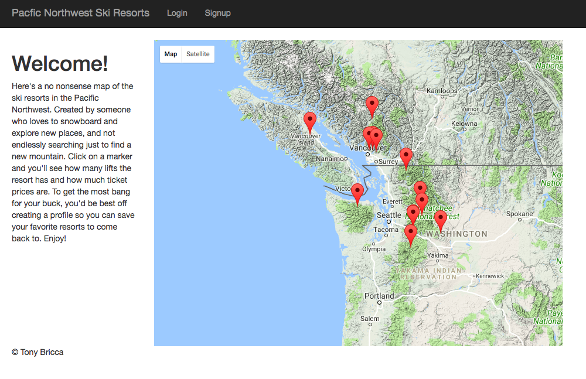
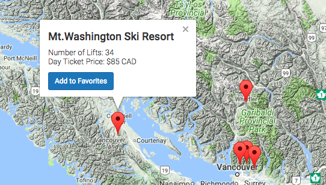
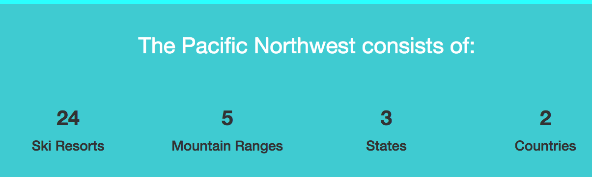

## Name: Tony Bricca

# Project Name: Ski Resort Map

## Curent Screenshot (Updated)

## Tech Used:
- HTML
- CSS
- Javascript
- Jquery
- Ajax
- Node
- Sequelize
- Express
- Git/Github
- Google Maps Api

## Process:

 I started this project with the aim to use the Google Maps Api to provide an easy way to find all the ski resorts in the Pacific Northwest. Through my research I recognized many websites have poor design and I felt I could do something simple to better show the information. I had the intention of creating a click function on the markers and have all the information about the ski resort display on the left hand side. I began by writing out a scrum board using trello to be able to track my progress. 

 

 Next, I then by installing my depencies such as node/express and then formed my basic styling and using my Google Maps Api, and decided to create my models later. I did this because I was less familiar with log in/log out functionality and I wasn't sure what I wanted my user functionality to be.
 
 ## Challenges 
 
 Creating my modeels later made things more difficult. It showed my indecsion over what models I wanted along with my log in/log out functionality. I had to figure out how to properly configure the app I already had to the framework I needed to add. Rather than, building the framework and then build the
 app into it. It taught me to better plan and wireframe what my process will be, even if I'm not 100% set on how I want the functionality to be.   

 ## Version 1 Screenshot 
 
 

 

 ## Next Steps:
 
 I intend to continue working on this project and improve it. I think there is a lot for me to learn, and a lot of useful functionality that i can add. I would like to add more ski resorts in the region as well as additional functionality for the user.

## Update 

To follow up, I added the rest of the ski resorts in the Pacific Northwest. I made the user interface much more pleasant to interact with by giving the page a hero header with a large background image of one of the ski resorts. In addition, I added counters for various statistics about the ski resorts as an engaging interface for users. I also made the map larger to give a better experience when looking for your next place to ski or snowboard!

